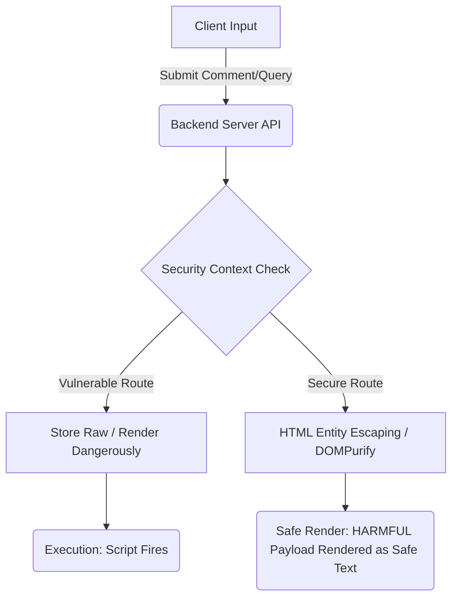

# 🛡️ XSS Learning Lab — Cyber Security Educational Portal

An interactive, double-sided laboratory and cybersecurity training platform designed to demonstrate the mechanics of Cross-Site Scripting (XSS) vulnerabilities and their real-world defensive counters. Developed using the MERN stack (MongoDB, Express, React, Node.js) with modular BEM styles.

---

## 🚀 Interactive Demos & Sandbox Modules
1. **Reflected XSS Sandbox**: Learn how untrusted query parameters or URL inputs are echoed by the server, executing scripts instantly.
2. **Stored XSS Sandbox**: Explore the persistence of script payloads saved permanently into a database (MongoDB) and served to subsequent visitors.
3. **DOM-Based XSS Sandbox**: Audit client-side Javascript sources (`location.hash`) writing directly into execution sinks (`innerHTML`) without server routing.

---

## 📊 Core Architecture Flow
Below is the request-response flow for vulnerable vs. secure endpoints:



---

## 📁 Workspace Folder Structure
```
Jovac/
├── backend/                  # Node.js/Express Backend Server
│   ├── config/               # Database Connection Configurations
│   ├── controllers/          # Business Logic for Safe vs. Unsafe APIs
│   ├── middleware/           # CORS handlers, Global Error, Helmet Security
│   ├── models/               # MongoDB Mongoose Data Schemas (Comment)
│   ├── routes/               # Express endpoints for Vulnerabilities & Health
│   ├── app.js                # Express App Entry Control Center
│   └── .env.example          # Environment Template
│
├── frontend/                 # Vite + React Client Application
│   ├── src/
│   │   ├── components/       # Reusable components (Navbar, Loader, CodeBlock, PageHeader, ErrorBoundary)
│   │   ├── layouts/          # Core Page Layout Template
│   │   ├── pages/            # Feature Sandboxes & Learning Modules
│   │   │   ├── ReflectedXSS.jsx
│   │   │   ├── StoredXSS.jsx
│   │   │   ├── DOMXSS.jsx
│   │   │   ├── Comparison.jsx
│   │   │   ├── Prevention.jsx
│   │   │   ├── PayloadLab.jsx
│   │   │   ├── Quiz.jsx
│   │   │   ├── Resources.jsx
│   │   │   ├── About.jsx
│   │   │   └── SecurityDisclaimer.jsx
│   │   ├── routes/           # React Router Route Rules (AppRoutes.jsx)
│   │   ├── services/         # Axios API instance configuration (api.js)
│   │   └── index.css         # Styling Tokens & Page Declarations (BEM-prefixed)
│   ├── vercel.json           # Vercel Single-Page App Config
│   └── package.json
```

---

## 🛠️ Installation & Setup

### Prerequisites
- Node.js (v18 or higher recommended)
- Local MongoDB instance running on `mongodb://localhost:27017`

### 1. Backend Server Configuration
Navigate to the `backend` directory:
```bash
cd backend
npm install
```
Create a `.env` file using the template:
```bash
cp .env.example .env
```
Start the backend server in development mode:
```bash
npm run dev
```
The server will boot on [http://localhost:5000](http://localhost:5000).

### 2. Frontend React Client
Open a new terminal tab and navigate to the `frontend` directory:
```bash
cd frontend
npm install
```
Start the development server:
```bash
npm run dev
```
The frontend portal will open on [http://localhost:5173](http://localhost:5173).

---

## 🌐 Environment Variables

### Backend (`backend/.env`)
- `PORT`: Server port (defaults to `5000`)
- `MONGODB_URI`: Local or remote MongoDB connection string (`mongodb://localhost:27017/xss-learning-lab`)
- `CORS_ORIGIN`: Allowed origin URL for cross-communication (`http://localhost:5173`)
- `NODE_ENV`: Current environment indicator (`development` or `production`)

### Frontend (`frontend/.env`)
- `VITE_API_URL`: Backend endpoint prefix (optional, e.g. `https://api.domain.com/api` in production)

---

## 🎓 Learning Objectives & Takeaways
- **Differentiate Vectors**: Define how query params, databases, and client-side DOM properties diverge.
- **Master Escaping**: Implement context-aware output encoding.
- **Implement Security Headers**: Deploy strict Content Security Policies (CSP) and HttpOnly flags on session state cookies.
- **Use Safe APIs**: Avoid `innerHTML` or `document.write()` in favor of `textContent` and sanitised bindings.

---

## 🤝 Contributors & Credits
- **Engineering and Concept**: Built by the JOVAC developer team.
- **Pair Programming**: Co-designed with the Antigravity AI coding assistant.
- **Licensing**: Licensed under the ISC License. Free to use for college projects, hackathons, and classroom lectures.